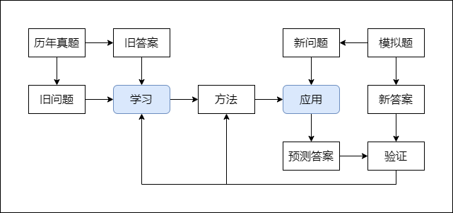
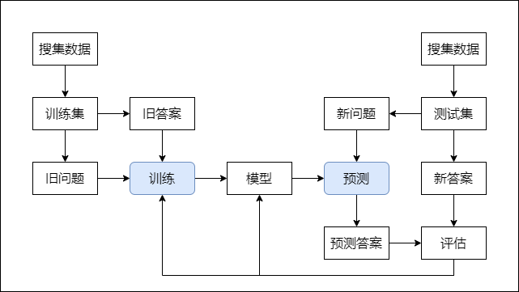

## 高考学习

### 高考学习

先从针对高考的学习入手。

高考学习是从历年真题的旧问题和旧答案中寻找方法，然后用找到的这个方法预测模拟题给出的新问题，并期待得出的预测答案和模拟题给出的新答案一致。

通过比对预测答案和新答案，就可以验证找到的方法的有效性，进而就可以判断学习能力。然后高校和用人单位就可以根据这个标准，判断人的学习能力，进而判断人的解决问题的能力。

### 机器学习

高考学习的这种学习方式可以对应机器学习中的监督学习。

监督学习是指有明确答案可供寻找问题与答案之间关系的学习方式。

在机器学习中。旧问题和旧答案叫作训练集，新的题和新答案叫作测试集，这两组数据是需要提前搜集和准备的。学习的过程叫作训练，得到的方法叫作模型，应用过程叫作预测。目的是用数据训练出模型并再应用。

人们总担心随着人工智能的发展，自己现在所做的工作会被机器替代。但是，就算没有人工智能，随着时间的推移，需要解决的问题必然会随之改变，想要保持自身解决问题的能力，就必须再次学习。重要的不是知识本身，而是学习知识的能力。

把已经发现的知识导入到计算机，这叫自动化。真正的机器学习不是把已经发现的知识导入到计算机，而是提供例子给计算机，让计算机自己去发现规律。最重要的是，让计算机去发现人类难以发现的规律。
