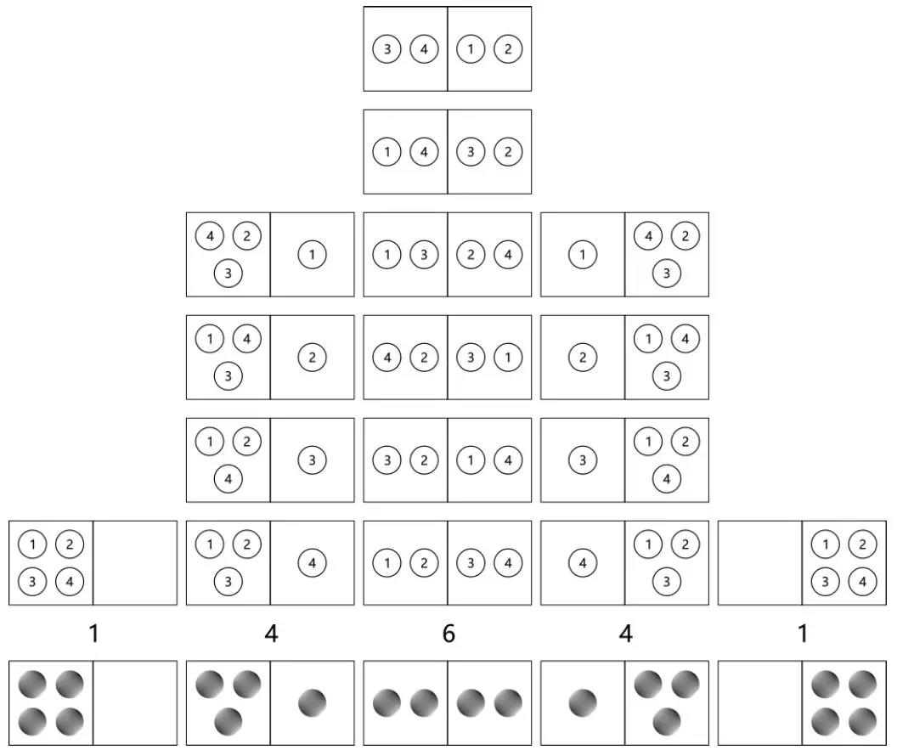

## 信息

### 熵

宏观态是不考虑内部细节的状态，微观态是考虑具体细节的状态。

可以借助下图来理解。最下面的灰色球表示宏观态，宏观态只看球的个数不考虑球上的数字。每种宏观态对应不同数量的微观态，微观态需要考虑球上的数字。

当一件事情（宏观态）有多种可能情况（微观态）时，这件事情对某人（观察者）而言，具体是哪种情况的不确定性叫熵。所以，在上图中，中间这个左右各两个球的宏观态的熵最大。

概率和熵的区别在于，概率描述一件事情是某个可能情况的确定性，而熵描述一件事情到底是哪个情况的不确定性。概率的输入是常量（微观态），熵的输入是变量（宏观态）。

### 熵增定律

还是借助上图，4 个有标号的球排列组合。如果不考虑球的标号，有5种情况（宏观态）：左 4 右 0、左 3右 1、左 2 右 2、左 1 右 3、左 0 右 4。

球标号不同时重复计数（微观态），这时一定是左 2 右 2 的情况最多。同理，当球的数量趋于无穷的时候，可以得到，左右球数量相等的可能性最大。

这种自发向对应微观态数量最多的宏观态改变的现象就是热力学第二定律：热不可能自发地从低温物体传至高温物体。又因为这种改变无法自行逆转，故又称时间之矢。

比如，房间自发越变越乱。但这并非由什么外力所引起的，原因单纯只是因为我们把它弄乱（宏观态）的方式比把它弄整齐（宏观态）的方式要多得多。

这种物理上的现象，可以用信息上的熵来理解。因此热力学第二定律也叫熵增定律：孤立系统的熵只增不减，宏观态达到熵最大状态时也叫热平衡。所以，把信息理解成一种能量，也是说的通的。

### 信息

信息是客观存在的物理量，描述的是一个观察者确定一个宏观状态是哪个微观状态所需要的物理量。信息不会随观察者的主观意识改变，人的主观意识不能消除事物的不确定性。

接收到的信息是相对于观察者已经对该事情的实际了解程度而言的。能够消除某人对一件事情的不确定性的事物才叫信息。那些不能够消除某人对一件事情不确定性的事物被称为噪音或数据。

噪音是干扰某人获取信息的事物，数据是噪音与信息的混合，需要用知识将其分离。信息、数据、知识是不同的东西。

熵和信息数量相等，意义相反，获取信息意味着消除熵（不确定性）。同一个观察者，对同一件事情接收到的信息与用于传递信息的信号形式无关。表达信息的媒介是可变的，不变的是信息本身。

### 信息的测量

从测量质量的概念入手，方便理解测量信息的概念。

最开始人们是没有千克的概念的。人们只是选择了一个参照物体，并把这个参照物体的质量定义为千克。如果参照物体变了，那么单位也会变化（比如，斤）。然后，其他待测物体的质量，就用这个物体的质量去表示。

当测量质量时，人们用除法。用待测物体的质量除以参照物体的质量，得到一个倍数。也就是，线性关系，描述多少个参照物体的质量和待测物体的质量相当。

信息的测量也是一样，信息消除的是不确定性，那么就选择另一个事件的不确定性作为参照事件（比如，定义抛硬币的答案的信息量为 1 bit）。当想要测定待测事件的不确定性时，就看待测试件的不确定性，相当于多少个参照事件的不确定性。

但是，测量信息时，不能用除法。因为，抛三个硬币，其所有的结果为 $2^3=8$ 种。也就是说，不是线性关系，而是指数关系。所以，当知道可能情况的个数，想求这些情况相当于多少个参照事物所产生的时候，就用指数运算的反函数，即对数函数来计算。

比如，以抛硬币为参照事件，在不知道答案的情况下，解决一道四选一选择题的信息量为 $log_2{4}$ 。2 为参照事件有两种等概率的情况，4 为待测事件四选一选择题有 4 种等概率的情况。假设，从外部得知其中一个选项是错的。这时，解决这道选择题的信息量为 $log_2{3}$ ，外部提供的信息量为 $log_2{4}-log_2{3}$ 。