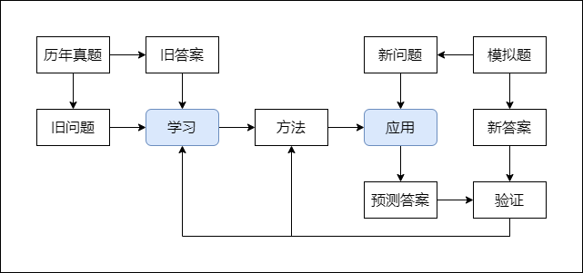
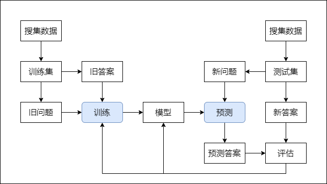

## 学习

### 高考学习

高考学习是从历年真题的旧问题和旧答案中寻找方法，然后用找到的这个方法预测模拟题给出的新问题，并期待得出的预测答案和模拟题给出的新答案一致。通过比对预测答案和新答案，就可以验证找到的方法的有效性，进而就可以判断学习能力。

### 机器学习

高考学习的这种学习方式可以对应机器学习中的监督学习。监督学习是指有明确答案可供寻找问题与答案之间关系的学习方式。

在机器学习中。旧问题和旧答案叫作训练集，新的题和新答案叫作测试集，这两组数据是需要提前搜集和准备的。学习的过程叫作训练，得到的方法叫作模型，应用过程叫作预测。目的是用数据训练出模型并再应用。

人们总担心随着人工智能的发展，自己现在所做的工作会被机器替代。但是，就算没有人工智能，随着时间的推移，需要解决的问题必然会随之改变，想要保持自身解决问题的能力，就必须再次学习。重要的不是知识本身，而是学习知识的能力。

把已经发现的知识导入到计算机，这叫自动化。真正的机器学习不是把已经发现的知识导入到计算机，而是提供例子给计算机，让计算机自己去发现规律。最重要的是，让计算机去发现人类难以发现的规律。

### 记忆

记忆不是学习，把九九乘法表背下来的行为就是记忆。

九九乘法只有 81 种情况。如果遇到的问题在这 81 种情况内，就可以得到答案。但是，如果问题不在这 81 种情况内，就无法的到答案。

由此可见，想靠记忆解决所有的乘法问题有两个限制：第一、外界提供问题的全部答案。第二、有足够的地方存储这些答案。

### 学习

从有限的例子（也可以概括为信息）中找出问题和答案之间的规律（也可以称为知识）的行为就是学习。

学习是为了能够解决无限的问题。所以，找出的规律既要能验证已有的例子，也要能解决从未见过的例子。正确的规律一定要能解决从未见过的例子，因为不能排除找到的规律可能是在特定条件下刚好生效。严格来说，只有找到能解决从未见过的例子的规律，才算达到学习的目的。

为什么看了那么多道理，听了那么多人生讲座，依然活不好一生。一个原因就在于，讲述者向你展示的例子都是已经发生过的样本，他所归纳出的方法，可以轻松地拟合这些样本，但却未必对你面临的新问题同样奏效。

### 信息

信息是客观存在的，一条信息描述一个具体的问题的一个具体的答案。

### 知识

知识是规律，描述问题与答案之间的关系。

知识一定要能压缩信息。也就是，学习后要记忆的内容（规律）一定要比学习前要记忆的内容（有限的例子）少。如果学习后要记忆的内容反而变多了，就没有达到学习得目的。

华罗庚先生的"先把书读厚，再把书读薄"的学习方法可以理解成：先尽可能的搜集更多的例子帮助体会问题和答案之间的关系，而当真正学会的时候，这些例子就被压缩成知识。

### 输入和输出

学习的第一步要做的就是，明确什么是问题（输入），什么是答案（输出）。知识是从例子的问题和答案之间找出来的规律。如果连要学习的知识所描述的问题和答案都不清楚，那最后只是记住了知识的描述而已。

光看定义是学不会知识的。这就是学习理科类的知识时，感觉学会了，但是不会应用的原因。其实只是看懂了的知识的描述，并没有能够做到举一反三。

如果搞错了输入和输出，还会导致学到错误的知识。用学英语举例：听、说、读、写、意思，其实是 5 个不一样的东西。

学听力的时候，不应该把声音关联到文字再关联到意思，应该是声音直接到意思。比如，应该是：英语->具象，而不是：英语->汉语->具象。最终效果应该是：desk->真实世界中的桌子，而不是：desk->桌子->真实世界中的桌子。

学口语的时候，也不应该把意思转换成文字再输出声音，应该是意思直接到声音。

### 费曼学习法

费曼学习法是以目的为导向的学习方法，核心在于验证知识。

验证知识的手段就是以教促学，分为两步，学习和解释。当可以从有限的例子中提取知识来解释新的情况时，就意味着你真的学会了。

《论语》中的"温故而知新，可以为师矣"里的"故"可以理解成学习时的例子，"新"可以理解成未见过的例子。"温故而知新"就意味着真正的学会了知识。

### 知识的分类

#### 以大脑运作模式为视角

知识可分为两类：运动类（语言、动作）和思考类（逻辑）。

两类的区别在于是否依赖意识。意识擅长解决推断类的问题，但是速度慢。运动类知识可以同时运用多个，比如边走路边聊天。但是，意识在某个时刻只能专注于一个思考类知识。

学习的时候需要注意，不要用思考类的方式学习运动类的知识，也不要用运动类的方式学习思考类的知识。在学习运动类知识往往要直接关注输入和输出，但在应用思考类知识时却相反。

在解决问题时，如果需要的知识超过我们的知识范围，意识无法从脑中直接搜索到知识，就无法解决问题。应对办法可以是学习更多的知识，也可以是分而治之。分而治之，就是把超出知识范围的大问题，拆解成在知识范围内的小问题。

假设解决某个问题需要用到 n 种知识。如果不分而治之，那么需要记忆所有的组合，也就是 $2^n - 1$ 种组合。如果能分而治之，那么每个小问题只需要用 1 种知识，一共是 n 种组合。

这可以将原本需要指数级知识量才能解决的问题，变成线性级知识量就可以解决的问题。这就造成了，知识量相同的两个人，会因为思维方式，造成解决问题能力落在两个不同等级上。

#### 以任务类型为视角

知识可分为两类：分类知识（classification）和回归知识 （regression）。

分类知识用于判断一个事物属于哪个类型。比如，2 是奇数还是偶数。

分类知识是最常用的知识，因为解决问题之前，都是先用分类知识来判断问题属于哪一类，然后才能够针对性的应用知识。

回归知识涉及如何从一种状态变成另一种状态。比如，怎么骑自行车。

### 思维导图

思维导图是以过程为导向的学习方法，的核心在于拆分知识。

学习时，将要学习的大知识拆分成小知识的组合，这样可以复用已经学会的知识，专注于未学会的知识。应用时，将解决问题所需的未知的知识拆分成已知的知识。

注意，思维导图的构建一定要自己动手，记忆别人的思维导图是没有用的。
