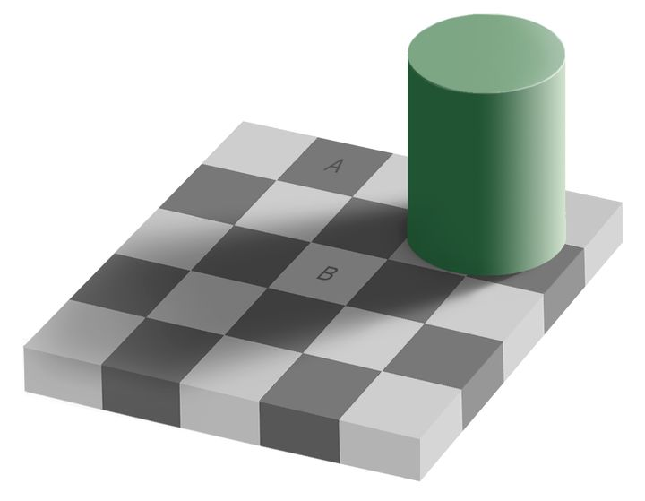

## 模型

### 感知与真实

为什么要学习，这个问题需要从对世界的感知开始。

人对世界的感知不是世界的真实，人所体验到的，实际上是大脑给出的一种对真实的替代。人根据器官来感知世界，人的眼睛看到的世界并非是其真实样貌，而是由演化出的视觉模型所产生的输出。

由于得到的信息是有限的，但是又需要存活下去，因此需要模型来预测发生的事件。魔术正是利用认知模型的预测与真实事件的差异来达到给人们冲击的目的。

比如，下面的图片里，A 和 B 看似不同。但是，实际上 A 和 B 是相同颜色。因为周边环境的颜色造成的相对的感知，让人的视觉模型觉得 B 亮于 A。

人最古老、最强烈的情感是恐惧，而最古老、最强烈的恐惧是对未知的恐惧。人的身体每时每刻都在获取信息来决定下一步的行为。当人闭上眼睛向前走时，哪怕知道前面是平坦的，身体也会因为无法获得必要的信息而逐渐失去平衡。

人依赖信息而活，然而，人又是无法获取所有信息的。有些信息在观测到之际，观测者已经等同于死亡。

### 模型

真实世界处于不停地变化之中，也就是有无限的信息。人没有能力感知全部的真实，所以才不得不依赖模型而存活。大脑追求的不是真实，感知真实无法保证我们存活，所以大脑主动忽略了部分内容。

大脑追求的是可以依赖的模型，尽管模型感知到的不是真实，但是却是赖以生存的唯一工具，如果不相信自己的模型就无法做出预测从而做出决策。学习正是为了构建这些模型从而更好地看清世界，更好的在所处的环境中生存。

### 观念

观念是由模型产生的，观念和知识的区别在于，知识可以被验证，但是观念不可以。人与人之间一切冲突都源于观念的不同，也就是观念背后模型的不同，这也是杠精为什么全力袒护自己的模型的原因。

### 好奇心

好奇心并不会随着年龄的增长而消退，好奇心是演化出来促进学习的奖励机制。好奇心的目的是为了构建知识，让人可以适应当前的环境，从而得以生存。

人不是不喜欢学习，而是不喜欢不符合大脑特点的记忆。多数人的学习只是知道自己需要学习，最终变成强迫自己去记忆知识，又怎么可能会喜欢呢。

大脑不能通过记忆来构建知识，只能通过例子来构建知识，这也是人们为什么喜欢听故事的原因。故事可以帮助大脑明确输入和输出，当只有一个输入或者只有一个输出时，好奇心会使得大脑急切地想要知道另一个，以帮助搜集一个完整的例子。

对分类知识，好奇的是判断依据；对回归知识，好奇的是如何做到。